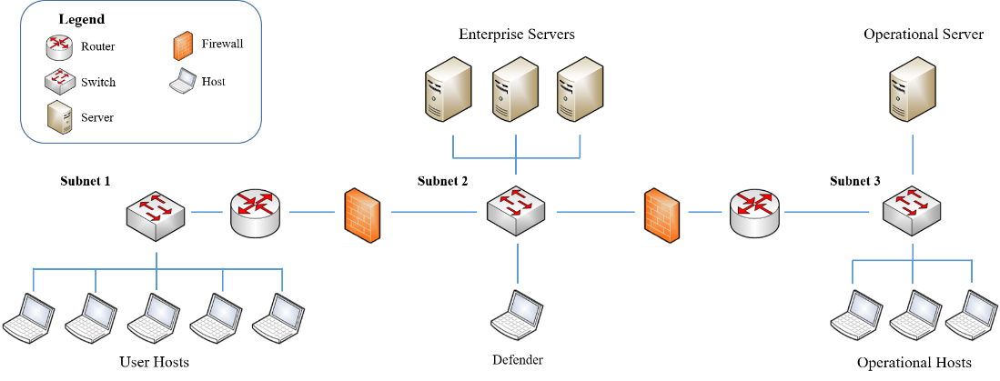

.. _Keyboard Agent:

Keyboard Agent
===============
The Keyboard Agent is a tool to help the user get familiar with how the agent will play the game in CybORG. Instead of the agent playing the game, the user will be the one making the decisions and learning how to play the game.
This will give a better idea of what actions are available and what observations a reinforcement agent has access to during a game.

Running the Keyboard Agent
--------------------------
The scenario network diagram that this Keyboard Agent will play in CybORG is illustrated below.

Locate the TestKeyboard files and run the python scripts to begin playing.

For a Red Agent:

.. code-block:: bash

    /CybORG/Agents/SimpleAgents/TestKeyboardRed.py

The Red Agent will initialise with a privileged host on subnet one. The goal of the player is to pivot through the network to gain privileged access to the Operational Server (Op_Server0) and impact this server.

The set of actions available to a Red Agent are:

.. list-table::
   :widths: 25 25
   :header-rows: 1

   * - Actions
     - Function
   * - Sleep
     - Do Nothing.
   * - Discover Remote Systems
     - Perform a ping sweep on the selected subnet.
   * - Discover Network Services
     - Perform a port scan on the selected device.
   * - Exploit Remote Service
     - Perform an exploit on the selected device.
   * - Impact
     - With root access on the Op Server, impact the network.

For a blue agent:

.. code-block:: bash

    /CybORG/Agents/SimpleAgents/TestKeyboardBlue.py

The blue agent will begin with an overview of all the systems in the network and is tasked to continuously monitor the network for any signs of intrusion.
When the agent observes a change in the network, it can attempt to stop or delay the actions of the malicious user. Also note that there will network activity
performed by a green agent, which represents activity from a regular non-malicious user.

The set of actions available to a blue agent are:

.. list-table::
   :widths: 25 25
   :header-rows: 1

   * - Actions
     - Function
   * - Sleep
     - Do nothing.
   * - Monitor
     - Update the network status.
   * - Analyse
     - Analyse the host if it has been compromised.
   * - Remove
     - If host has been compromised at a 'user' level, then this action can remove malicious users.
   * - Restore
     - If host has been compromised at a 'root' level, then this action can restore the host.

