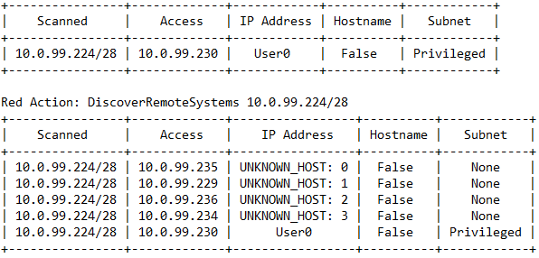

.. _SettingUp:

Setting up an Agent
=============================

Wrappers
~~~~~~~~
CybORG takes in inputs and outputs of data as a dictionary format to represent the configurations of the cyber network.
We have developed a series of wrappers to represent this data in forms more appropriate to reinforcement learning.

.. list-table::
   :widths: 10 30
   :header-rows: 1

   * - Wrapper
     - Function
   * - FlatFixedWrapper
     - Converts CybORG's observation space data structure (dict) into a vector of integers (list).
   * - IntListToActionWrapper
     - Converts CybORG's action space data structure (dict) into a vector of integers (list).
   * - OpenAIGymWrapper
     - Sets CybORG to conform to OpenAI Gym's requirements and allows the environment to utilise its functions.

       CybORG can be used with either gym space: MultiDiscrete or Discrete.

       - MultiDiscrete requires *IntListToActionWrapper*
       - Discrete requires *EnumActionWrapper*

   * - EnumActionWrapper
     - Enumerates the list of possible actions the agent can perform and outputs a discrete integer value. This will allow
       the gym to conform to OpenAI discrete space properties.
   * - ReduceActionSpace
     - Reduces the number of possible actions to the number of realistic possible actions.

       For example, 'Privilege Escalate' only requires parameters for session ID, agent name and host name, while it also has parameters for IP addresses, subnet, usernames etc. This will reduce the number of combinations that represent the action space the agent can choose from.
   * - RedTableWrapper
     - This wrapper is used as an alternative to the FlatFixedWrapper. CybORG ordinarily gives the agent unfiltered access to the observable state of the game. This wrapper limits the observable state to what the agent can currently see. The observable state will continue to grow as the agent progresses through the game.
   * - BlueTableWrapper
     - This wrapper is identical to the RedTable Wrapper, except that it limits the agent to what the Blue agent could observe.

Setting up a Red Agent
~~~~~~~~~~~~~~~~~~~~~~
**FlatFixedWrapper**

Here is the minimal example of getting CybORG to run with a Red agent under the FlatFixedWrapper. This will run the
CybORG game with Scenario1b for 1000 time steps, performing a random action and rendering the environment at each step.

.. code-block:: python

    import inspect
    from CybORG import CybORG
    from CybORG.Agents.Wrappers.OpenAIGymWrapper import OpenAIGymWrapper
    from CybORG.Agents.Wrappers.FixedFlatWrapper import FlatFixedWrapper
    from CybORG.Agents.Wrappers.IntListToAction import IntListToActionWrapper

    path = str(inspect.getfile(CybORG))
    path = path[:-10] + '/Shared/Scenarios/Scenario1b.yaml'

    agent_name = 'Red'
    cyborg = OpenAIGymWrapper(agent_name=agent_name, env=IntListToActionWrapper(FlatFixedWrapper(CybORG(path, 'sim'))))
    obs = cyborg.reset()
    for i in range(1000):
        action = cyborg.action_space.sample()
        obs, reward, done, info = cyborg.step(action)
        if done:
            break

**RedTableWrapper**

Here is the minimal example of getting CybORG to run with a Red agent with the RedTableWrapper.

.. code-block:: python

    import inspect
    from CybORG import CybORG
    from CybORG.Agents.Wrappers.RedTableWrapper import RedTableWrapper
    from CybORG.Agents.Wrappers.OpenAIGymWrapper import OpenAIGymWrapper
    from CybORG.Agents.Wrappers.EnumActionWrapper import EnumActionWrapper
    from CybORG.Agents.Wrappers.ReduceActionSpaceWrapper import ReduceActionSpaceWrapper

    path = str(inspect.getfile(CybORG))
    path = path[:-10] + '/Shared/Scenarios/Scenario1b.yaml'

    cyborg = OpenAIGymWrapper(agent_name='Red', env=RedTableWrapper(EnumActionWrapper(ReduceActionSpaceWrapper(CybORG(path, 'sim'))), output_mode='vector'))
    obs = cyborg.reset()
    cyborg.render()
    for i in range(1000):
        action = cyborg.action_space.sample()
        obs, reward, done, info = cyborg.step(action)
        cyborg.render()
        if done:
            break

Example output:

|
| Above are examples of a Red agent playing the scenario on its own but you can also specify a Blue agent to be played against. In this example a rules-based Blue agent, BlueReactRestore is specified. (This also applies to the FlatFixedWrapper)

.. code-block:: python

    import inspect
    from CybORG import CybORG
    from CybORG.Agents.Wrappers.RedTableWrapper import RedTableWrapper
    from CybORG.Agents.Wrappers.OpenAIGymWrapper import OpenAIGymWrapper
    from CybORG.Agents.Wrappers.EnumActionWrapper import EnumActionWrapper
    from CybORG.Agents.SimpleAgents.BlueReactAgent import BlueReactRemoveAgent
    from CybORG.Agents.Wrappers.ReduceActionSpaceWrapper import ReduceActionSpaceWrapper

    path = str(inspect.getfile(CybORG))
    path = path[:-10] + '/Shared/Scenarios/Scenario1b.yaml'

    cyborg = OpenAIGymWrapper(agent_name='Red', env=RedTableWrapper(EnumActionWrapper(ReduceActionSpaceWrapper(CybORG(path, 'sim', agents={'Blue': BlueReactRemoveAgent}))), output_mode='vector'))
    obs = cyborg.reset()
    cyborg.render()
    for i in range(1000):
        action = cyborg.action_space.sample()
        obs, reward, done, info = cyborg.step(action)
        cyborg.render()
        if done:
            break

Setting up a Blue Agent
~~~~~~~~~~~~~~~~~~~~~~~

**FlatFixedWrapper**

Similarly, here is a minimal example of getting CybORG to run with a Blue agent. In this example a rules-based Red agent, B_lineAgent, is specified.

.. code-block:: python

    import inspect
    from CybORG import CybORG
    from CybORG.Agents.SimpleAgents.B_line import B_lineAgent
    from CybORG.Agents.Wrappers.OpenAIGymWrapper import OpenAIGymWrapper
    from CybORG.Agents.Wrappers.FixedFlatWrapper import FlatFixedWrapper
    from CybORG.Agents.Wrappers.IntListToAction import IntListToActionWrapper

    path = str(inspect.getfile(CybORG))
    path = path[:-10] + '/Shared/Scenarios/Scenario1b.yaml'

    agent_name = 'Blue'
    cyborg = OpenAIGymWrapper(agent_name='Blue', env=IntListToActionWrapper(FlatFixedWrapper(CybORG(path, 'sim', agents={'Red': B_lineAgent}))))
    obs = cyborg.reset()
    for i in range(1000):
        action = cyborg.action_space.sample()
        obs, reward, done, info = cyborg.step(action)
        if done:
            break

**BlueTableWrapper**

Here's is the minimal example of getting CybORG to run with a Blue agent using the BlueTableWrapper. In this example a
rules-based Red Agent, RedMeanderAgent, is specified.

.. code-block:: python

    import inspect
    from CybORG import CybORG
    from CybORG.Agents.SimpleAgents.Meander import RedMeanderAgent
    from CybORG.Agents.Wrappers.BlueTableWrapper import BlueTableWrapper
    from CybORG.Agents.Wrappers.OpenAIGymWrapper import OpenAIGymWrapper
    from CybORG.Agents.Wrappers.EnumActionWrapper import EnumActionWrapper
    from CybORG.Agents.Wrappers.ReduceActionSpaceWrapper import ReduceActionSpaceWrapper

    path = str(inspect.getfile(CybORG))
    path = path[:-10] + '/Shared/Scenarios/Scenario1b.yaml'

    cyborg = OpenAIGymWrapper(agent_name='Blue', env=BlueTableWrapper(EnumActionWrapper(ReduceActionSpaceWrapper(CybORG(path, 'sim', agents={'Red': RedMeanderAgent}))), output_mode='vector'))
    obs = cyborg.reset()
    cyborg.render()
    for i in range(1000):
        action = cyborg.action_space.sample()
        obs, reward, done, info = cyborg.step(action)
        cyborg.render()
        if done:
            break

Example output:

.. image:: _img_table_example_blue.png

Rules-based Agents
~~~~~~~~~~~~~~~~~~

.. list-table::
   :widths: 10 30
   :header-rows: 1

   * - Agent
     - Function
   * - B_lineAgent
     - A Red rules-based agent that is designed to take the optimal path to exploit the Op_Server0 and impact the network.
   * - RedMeander Agent
     - A Red rules-based agent that takes in a random action and meanders around the network.
   * - BlueReactRestore Agent
     - A Blue rules-based agent that takes only the 'Restore' action at each time step.
   * - BlueReactRemove Agent
     - A Blue rules-based agent that takes only the 'Remove at each time step.
